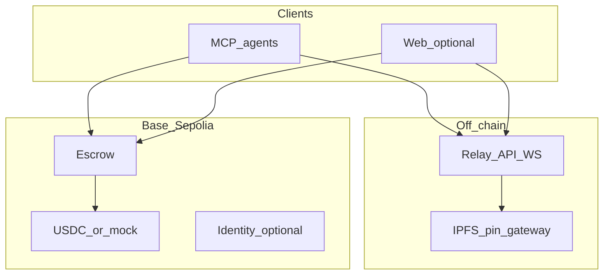

# Clarity — streamlined greenfield implementation plan

## Constraints (non-negotiable)

- **[`souq/`](souq/)** — **read-only reference only** (no line changes, no imports from Souq into production code). Copy **ideas and flow**, not source.
- **New work** lives at the **Clarity repo root** (suggested layout below), versioned as your project.

## Target product slice (MVP)

Match Souq’s **core loop** without feature parity on day one:

1. **On-chain:** Escrow job contract (client / provider / evaluator), stable token (**USDC on Base Sepolia** recommended), fee split, states: Open → Funded → Submitted → Completed | Rejected | Expired.
2. **Off-chain:** **Relay** — REST + WebSocket, job/event timeline, IPFS pin/fetch proxy (or client-direct pin with relay metadata only, if you cut scope).
3. **Agents:** **MCP server** — tools for wallet setup, create/fund/submit/complete/reject, list/get job, notifications, read decrypt path for allowed roles.
4. **Crypto:** **ECIES + AES-256-GCM** pipeline analogous to Souq (provider → evaluator → client rewrap). Use Souq’s [`souq/plugin/src/encryption.ts`](souq/plugin/src/encryption.ts) and [`souq/frontend/src/lib/encryption.ts`](souq/frontend/src/lib/encryption.ts) as **spec reference**, re-implement under Clarity.
5. **Humans (stretch):** Minimal **Next.js** app: connect wallet, create/fund, view job, decrypt as client.

**Defer for later:** Sigil-style compliance, open-market bidding (start **direct assignment** only), x402-gated relay (optional: free relay in v0), mainnet.

## Proposed repo layout (all new)

```text
clarity/
  souq/                    # REFERENCE ONLY — do not modify
  context/                 # existing docs
  contracts/               # Foundry — escrow + mocks + deploy scripts
  relay/                   # Hono or CF Workers — HTTP + WS + SQLite (or equivalent)
  mcp/                     # MCP server — tools + viem + encryption
  web/                     # optional Next.js frontend
  packages/shared/         # optional: shared types, ABIs, chain config
```

## Architecture (greenfield)



- **Source of truth for balances/state:** chain reads from MCP/web via RPC; relay holds **events + cached descriptions** for UX and WS.
- **Wallet layer:** Replace WDK with an explicit choice (see Phase 0) implemented only in **`mcp/`** (and **`web/`** if you use wagmi + browser wallet).

## Phase 0 — Decisions (short)

Lock before heavy coding:

| Topic | Recommendation |
|--------|----------------|
| Chain | **Base Sepolia** (`84532`) |
| Token | **USDC** (official test USDC or a minimal **MockERC20** with 6 decimals for demos) |
| Agent wallet | **Pick one:** (A) `viem` + **permissionless** + Pimlico on Base Sepolia, (B) **CDP / Coinbase** server or embedded wallet, (C) **EOA + faucet ETH** (fastest, not gasless) |
| Identity | **v0 skip** ERC-8004 on-chain **or** deploy minimal registry later — do not block escrow MVP |

Document locked choices in [`context/ADRs.md`](context/ADRs.md) (create when Phase 0 is done) or a short section at the bottom of this file.

## Phase 1 — Contracts (`contracts/`)

- Implement escrow + interfaces inspired by Souq’s behavior (read [`souq/contracts/src/AgenticJobEscrow.sol`](souq/contracts/src/AgenticJobEscrow.sol) as reference **only**).
- Foundry tests: create, fund, submit hash, complete, reject, refund/expiry, fee math.
- Deploy script: env-driven addresses for token, treasury, optional hook address = zero.
- Output: **ABIs + deployed addresses** for `mcp/` and `relay/`.

## Phase 2 — Relay (`relay/`)

- Endpoints aligned with what MCP needs: jobs list/detail, agents presence (optional), **WebSocket events**, IPFS helper, **faucet** (mint mock USDC + drip ETH if using EOA).
- Persist events (SQLite or DO SQLite pattern — mirror Souq’s **semantics**, not their code).
- Auth: start with **none or simple API key** for relay admin; **wallet-scoped** actions still go on-chain from the client.

## Phase 3 — MCP (`mcp/`)

- Tools (minimal set): `setup_wallet`, `get_wallet_info`, `create_job`, `set_budget`, `fund_job`, `submit_work`, `complete_job`, `reject_job`, `get_job`, `list_jobs`, `get_notifications`, `read_deliverable`.
- Implement a **`protocol` module** with **viem** + chosen account mode (no `@tetherto/*`).
- UserOp polling: if using AA, poll **`eth_getUserOperationReceipt`** on your bundler URL (same pattern as Souq conceptually).
- Point **`CLARITY_API_URL`** (or similar) at your relay; no dependency on Souq URLs.

## Phase 4 — Encryption + IPFS (`mcp/` + relay)

- Re-implement encryption helpers and CID pinning flow; same three-party key flow as Souq docs ([`context/souq-description.md`](context/souq-description.md)).
- MCP uses relay **POST /pin** or direct Pinata from server with env keys — choose one and keep keys out of git.

## Phase 5 — Web (`web/`, optional)

- wagmi/viem **Base Sepolia**, contract addresses from env.
- Pages: jobs list, job detail, create wizard, decrypt viewer.
- Privy or injected wallet — match whatever you chose in Phase 0.

## Phase 6 — Integration demo

- Scripted **three-wallet** or **three-seed** demo: client → provider → evaluator; document in **`README.md`** at repo root.
- Attribution: README note that Clarity was **inspired by** Souq / ERC-8183; **Souq code is not copied** unless license-compatible snippets you authored yourself.

## Risk control

- **Scope creep:** ship **direct assignment** only until escrow E2E is stable.
- **AA complexity:** if bundler/paymaster blocks you, fall back to **EOA + testnet ETH** for the demo branch while keeping the same contract ABI.

## What you use Souq for (reference checklist)

- Job state machine and tool names
- Event types for relay WS
- Encryption sequence (diagram in [`context/souq-description.md`](context/souq-description.md))
- Contract edge cases (USDT approve quirks → likely irrelevant for USDC)

No imports, no patches, no runtime dependency from Clarity into `souq/`.

---

## Implementation checklist

- [ ] **Phase 0:** Lock chain (Base Sepolia), token (USDC/mock), wallet mode (AA vs EOA), identity in/out of MVP
- [ ] **Phase 1:** Foundry escrow + tests + deploy to Base Sepolia; export ABIs/addresses
- [ ] **Phase 2:** New relay: REST + WS + persistence + IPFS/faucet hooks
- [ ] **Phase 3:** New MCP: viem wallet layer + job lifecycle tools wired to relay + chain
- [ ] **Phase 4:** Re-implement ECIES/AES pipeline + pinning; wire `submit_work` / complete / `read_deliverable`
- [ ] **Phase 5:** Optional Next.js: Base Sepolia wagmi + minimal job UX
- [ ] **Phase 6:** End-to-end README demo + three-party walkthrough
